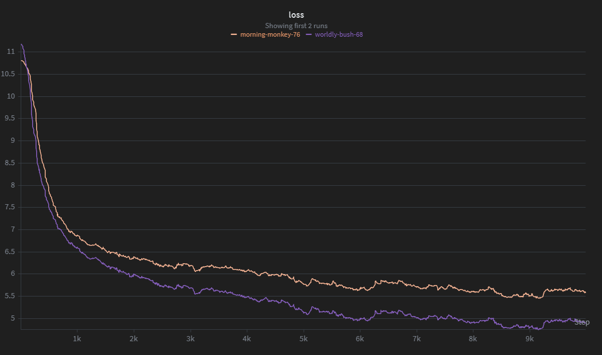

# Implementation of ATLAS: Learning to Optimally Memorize the Context at Test Time

## [Read the blog post here!](https://bhoener.github.io/posts/Implementing-ATLAS/)



## Usage

To setup the environment:

```shell
cd env
Scripts/activate.ps1
pip3 install -r requirements.txt
```

All code is located under `env/src`. There are three different architecture-specific files: `atlas.py`, `transformer.py`, and `linear_transformer.py` (PolySketchFormer). 

Before using any of these, first download the data using `env/src/download_data.py`. It will default to the `10B` sample of `fineweb-edu`, but you can configure it to take any huggingface dataset.


Then, you can run the code as follows:

```shell
python3 src/atlas.py
```

You can also test different settings using arguments:

```shell
python3 src/atlas.py --muon_lr 0.02
```

## References

Behrouz, A., Li, Z., Kacham, P., Daliri, M., Deng, Y., Zhong, P., Razaviyayn, M., & Mirrokni, V. (2025). ATLAS: Learning to Optimally Memorize the Context at Test Time. ArXiv.org. https://arxiv.org/abs/2505.23735

Kacham, P., Mirrokni, V., & Zhong, P. (2023). PolySketchFormer: Fast Transformers via Sketching Polynomial Kernels. ArXiv.org. https://arxiv.org/abs/2310.01655

Shazeer, N. (2020). GLU Variants Improve Transformer. ArXiv:2002.05202 [Cs, Stat]. https://arxiv.org/abs/2002.05202

Yang, S. (2024). DeltaNet Explained (Part I) | 
Songlin Yang. GitHub Pages. https://sustcsonglin.github.io/blog/2024/deltanet-1/